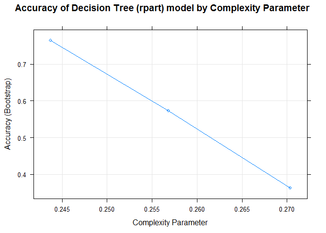
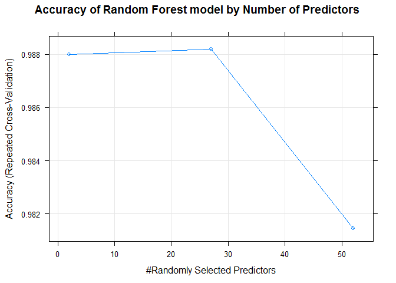

# Overview

People regularly quantify how much of a particular activity they do, but they rarely quantify how well they do it. In this project, we will use data from accelerometers on the belt, forearm, arm, and dumbell of 6 participants. They were asked to perform barbell lifts correctly and incorrectly in 5 different ways. More information is available from the website here: (http://groupware.les.inf.puc-rio.br/har) _(see the section on the Weight Lifting Exercise Dataset)_.

# Strategy
#### I) Data
We have 2 sets of data:

- The training set (https://d396qusza40orc.cloudfront.net/predmachlearn/pml-training.csv) is partioned into 2 sets:
    1) Training data
    2) Test data, used to check the Accuracy.
- The Test data (https://d396qusza40orc.cloudfront.net/predmachlearn/pml-testing.csv), which will be used for cross-validation.

#### II) Model Selection
We will build different models (using training data) and check their accuracy with test data. Based on their accuracy and performance we will select an appropriate model for our prediction. We will use _caret_ package in R for building our models.
 
We will use the following methods for model creation:

- MODEL1: _Bagging_, using _treebag_ method
- MODEL2: _Decision Tree_ using _rpart_ method
- MODEL3: _Random Forrest_, using _rf_ method
- MODEL4: _Boosting_, using _gbm_ method

If we do not get satisfactory results from above methods then we will explore combination of models.

#### III) Prediction based on selected model
At the end, we will predict the values for cross-validation data.

## I) Data
Let's download and load the data in R.
The original training data _(pml-training.csv)_ has **19622** observations and **160** variables (columns). The original testing data used from cross-validation has **20** observations and **160** variables. 


```
## Loading required package: lattice
```

```
## Loading required package: ggplot2
```

```
## [1] 19622   160
```

```
## [1]  20 160
```
First we will eliminate variables with _Near Zero Variation_. Following **60** variables were identified.


```
##  [1] "new_window"              "kurtosis_roll_belt"     
##  [3] "kurtosis_picth_belt"     "kurtosis_yaw_belt"      
##  [5] "skewness_roll_belt"      "skewness_roll_belt.1"   
##  [7] "skewness_yaw_belt"       "max_yaw_belt"           
##  [9] "min_yaw_belt"            "amplitude_yaw_belt"     
## [11] "avg_roll_arm"            "stddev_roll_arm"        
## [13] "var_roll_arm"            "avg_pitch_arm"          
## [15] "stddev_pitch_arm"        "var_pitch_arm"          
## [17] "avg_yaw_arm"             "stddev_yaw_arm"         
## [19] "var_yaw_arm"             "kurtosis_roll_arm"      
## [21] "kurtosis_picth_arm"      "kurtosis_yaw_arm"       
## [23] "skewness_roll_arm"       "skewness_pitch_arm"     
## [25] "skewness_yaw_arm"        "max_roll_arm"           
## [27] "min_roll_arm"            "min_pitch_arm"          
## [29] "amplitude_roll_arm"      "amplitude_pitch_arm"    
## [31] "kurtosis_roll_dumbbell"  "kurtosis_picth_dumbbell"
## [33] "kurtosis_yaw_dumbbell"   "skewness_roll_dumbbell" 
## [35] "skewness_pitch_dumbbell" "skewness_yaw_dumbbell"  
## [37] "max_yaw_dumbbell"        "min_yaw_dumbbell"       
## [39] "amplitude_yaw_dumbbell"  "kurtosis_roll_forearm"  
## [41] "kurtosis_picth_forearm"  "kurtosis_yaw_forearm"   
## [43] "skewness_roll_forearm"   "skewness_pitch_forearm" 
## [45] "skewness_yaw_forearm"    "max_roll_forearm"       
## [47] "max_yaw_forearm"         "min_roll_forearm"       
## [49] "min_yaw_forearm"         "amplitude_roll_forearm" 
## [51] "amplitude_yaw_forearm"   "avg_roll_forearm"       
## [53] "stddev_roll_forearm"     "var_roll_forearm"       
## [55] "avg_pitch_forearm"       "stddev_pitch_forearm"   
## [57] "var_pitch_forearm"       "avg_yaw_forearm"        
## [59] "stddev_yaw_forearm"      "var_yaw_forearm"
```

```
## [1] 19622   100
```

After elimination we are left with **100** variables in training dataset. 

We observe that many variables are have having no data i.e NAs or are empty (""). Our strategy will be to eliminate variables where more than _50%_ data is NOT available. We won't be getting good model fit with such cases. Following **41** variables were found with this condition.


```
##  [1] "max_roll_belt"            "max_picth_belt"          
##  [3] "min_roll_belt"            "min_pitch_belt"          
##  [5] "amplitude_roll_belt"      "amplitude_pitch_belt"    
##  [7] "var_total_accel_belt"     "avg_roll_belt"           
##  [9] "stddev_roll_belt"         "var_roll_belt"           
## [11] "avg_pitch_belt"           "stddev_pitch_belt"       
## [13] "var_pitch_belt"           "avg_yaw_belt"            
## [15] "stddev_yaw_belt"          "var_yaw_belt"            
## [17] "var_accel_arm"            "max_picth_arm"           
## [19] "max_yaw_arm"              "min_yaw_arm"             
## [21] "amplitude_yaw_arm"        "max_roll_dumbbell"       
## [23] "max_picth_dumbbell"       "min_roll_dumbbell"       
## [25] "min_pitch_dumbbell"       "amplitude_roll_dumbbell" 
## [27] "amplitude_pitch_dumbbell" "var_accel_dumbbell"      
## [29] "avg_roll_dumbbell"        "stddev_roll_dumbbell"    
## [31] "var_roll_dumbbell"        "avg_pitch_dumbbell"      
## [33] "stddev_pitch_dumbbell"    "var_pitch_dumbbell"      
## [35] "avg_yaw_dumbbell"         "stddev_yaw_dumbbell"     
## [37] "var_yaw_dumbbell"         "max_picth_forearm"       
## [39] "min_pitch_forearm"        "amplitude_pitch_forearm" 
## [41] "var_accel_forearm"
```

```
## [1] 19622    59
```
After eliminating them we are left with **59** variables in training data.

Performing the equivalent operations on test data to eliminate the variables.

```
## [1] 20 59
```

Dividing training data such that _70%_ is allocated for training model fit and remaining _30%_ for testing and calculating the accuracy.

```
## [1] 13737    59
```

```
## [1] 5885   59
```

## II) Model Selection
Let's explore different methods to find the best model.

#### MODEL1: _Bagging_, using _treebag_ method


```
##           Reference
## Prediction    A    B    C    D    E
##          A 1674    0    0    0    0
##          B    0 1138    0    0    0
##          C    0    1 1026    1    0
##          D    0    0    0  963    0
##          E    0    0    0    0 1082
```

```
##  Accuracy 
## 0.9996602
```

We get _99.97%_ accuracy using _treebag_ method.

#### MODEL2: _Decision Tree_ using _rpart_ method


```
##           Reference
## Prediction    A    B    C    D    E
##          A 1674    0    0    0    0
##          B    0 1138    0    0    0
##          C    0    0    0    0    0
##          D    0    0    0    0    0
##          E    0    1 1026  964 1082
```

```
##  Accuracy 
## 0.6616822
```

<!-- -->

We get a low _66.17%_ accuracy using _rpart_ method and is not encouraging.

#### MODEL3: _Random Forrest_, using _rf_ method


```
##           Reference
## Prediction    A    B    C    D    E
##          A 1674    0    0    0    0
##          B    0 1139    0    0    0
##          C    0    0 1026    0    0
##          D    0    0    0  964    0
##          E    0    0    0    0 1082
```

```
## Accuracy 
##        1
```

<!-- -->

The accuracy hits the peak at around 41 predictors and then starts declining.

We get a perfect _100%_ accuracy using _rf_ method.

#### MODEL4: _Boosting_, using _gbm_ method


```
##           Reference
## Prediction    A    B    C    D    E
##          A 1674    0    0    0    0
##          B    0 1138    0    0    0
##          C    0    1 1026    1    0
##          D    0    0    0  963    0
##          E    0    0    0    0 1082
```

```
##  Accuracy 
## 0.9996602
```

<!-- -->

We get _99.97%_ accuracy using _gbm_ method.


## III) Prediction based on selected model

##### Conclusion
Bagging _(99.97%)_, Random Forest _(100%)_ and Boosting models _(99.97%)_ provide above 99% accuracy. I found Random Forest to be slow. Finally, I have decided to go with boosting as it provides high accuracy and with reasonable performance. 

The Final predicted values from 20 observations from test data is as follows:


```
##  [1] A A A A A A A A A A A A A A A A A A A A
## Levels: A B C D E
```


